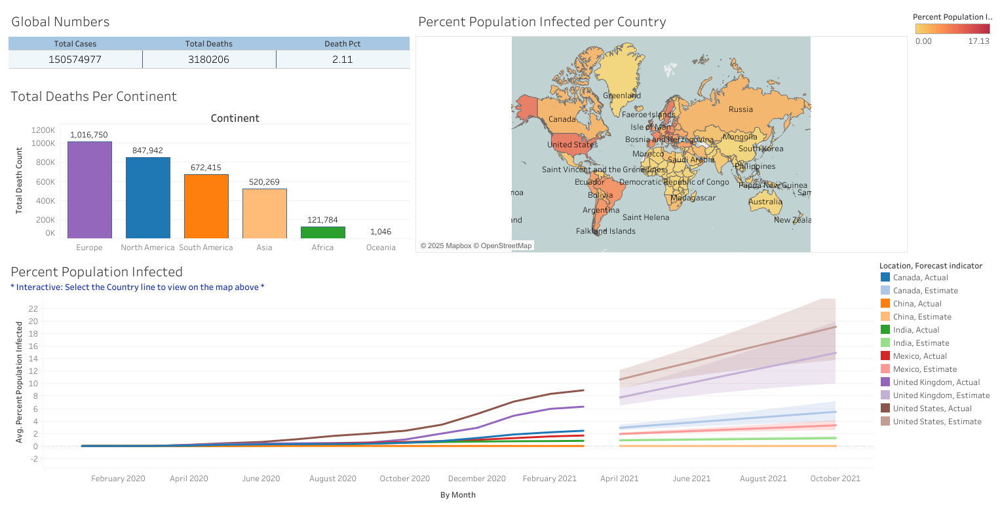

COVID-19 DASHBOARD – TABLEAU PUBLIC                                                                              APRIL 2024
-	Worked with a 12-month dataset on COVID-19 deaths and vaccinations
-	Used MySQL to query, clean, and structure the data for visualization  
	View COVID_Project_1.sql
-	Created an interactive Tableau dashboard to display trends and insights
-	Published project to Tableau Public: https://public.tableau.com/app/profile/LK.Insights

